# Proceso de creación de triggers

## 1. Objetivo y alcance

En este informe documento, en primera persona y por etapas, cómo crear en DBeaver un registro de auditoría para la tabla `alquiler` de la base de datos `Pedalibre`, en MySQL, Microsoft SQL Server (MSSQL), Oracle y PostgreSQL. Registraré las inserciones, actualizaciones y eliminaciones, conservando una copia de los valores anteriores y posteriores cuando corresponda. Comenzaré por MySQL; después de cada avance guardaré la evidencia correspondiente y prepararé un commit antes de continuar con el siguiente paso o motor.

Ya creé el modelo de datos en los cuatro motores. Las capturas que guardé en `../trazabilidad/` muestran la base, la tabla y el diagrama existentes; no las presento como evidencia de que ya ejecuté los triggers.

## 2. Tablas seleccionadas y motivo

### Tabla principal: `alquiler`

Seleccioné `alquiler` porque es una entidad central del sistema Pedalibre: registra el uso efectivo de una bicicleta por parte de un cliente y sus cambios pueden afectar el estado operativo y el valor del servicio. Quiero poder consultar quién modificó un alquiler, cuándo lo hizo y qué valores cambiaron.

Al revisar el modelo de los cuatro motores, confirmé que `alquiler` contiene estas columnas:

| Columna | Uso en la auditoría |
|---|---|
| `id` | Identificador del alquiler y vínculo lógico desde el registro de auditoría. |
| `reserva_id` | Reserva asociada, cuando existe. |
| `bicicleta_id` | Bicicleta utilizada. |
| `cliente_id` | Cliente relacionado con el alquiler. |
| `fecha_inicio`, `fecha_fin` | Periodo del alquiler. |
| `total` | Importe registrado. |
| `estado` | Estado operativo del alquiler. |
| `observaciones` | Información adicional del alquiler. |

Auditaré la fila completa para que las capturas anterior y posterior sean útiles aunque cambie la regla de negocio. Guardaré la auditoría en una tabla nueva llamada `alquiler_audit`, sin clave foránea hacia `alquiler`; así, una eliminación en cascada no borrará el historial ni la auditoría impedirá eliminar un alquiler.

### Tablas relacionadas que no se auditan en esta etapa

- No elegí `evento_alquiler` porque ya representa eventos del ciclo de vida del alquiler. Es información de negocio, no un historial técnico de quién cambió una fila, así que no reemplaza a `alquiler_audit`.
- Dejo `pago` fuera de esta primera etapa porque contiene información financiera y utiliza referencias polimórficas (`referencia_tipo`, `referencia_id`) en vez de una clave foránea directa a `alquiler`. Así mantengo acotado el ejercicio y evito exponer más datos sensibles de los necesarios.
- También dejo `penalidad` para una posible fase posterior, si necesito rastrear cambios de penalizaciones.

## 3. Consideraciones de seguridad e integridad

Considero que un trigger facilita la auditoría automática, pero no elimina por sí solo las vulnerabilidades. Por eso usaré privilegios mínimos para la cuenta que ejecuta el trigger y para la cuenta de la aplicación; limitaré la lectura de `alquiler_audit`, porque sus snapshots contienen identificadores y observaciones; y tendré en cuenta la retención y las copias de seguridad.

No añadiré una bandera de sesión como `@from_sales_trigger`: cualquier cliente puede establecer una variable de sesión, por lo que no la considero una autorización confiable. Tampoco asumiré que el historial es inmutable frente a un administrador del motor, quien podría modificar los triggers o la tabla de auditoría. Para reforzar la protección, separaré roles, restringiré `UPDATE`/`DELETE` sobre la auditoría, monitorearé cambios de esquema y respaldaré los registros.

El SQL de cada apartado es específico para el motor indicado. Ejecutaré solamente el bloque correspondiente a la conexión de DBeaver y al esquema donde reside `alquiler`. Los ejemplos presuponen que la tabla se encuentra en el esquema predeterminado del usuario del proyecto (por ejemplo, `dbo` en SQL Server).

## 4. Preparación en DBeaver

1. Me conectaré en DBeaver a la base `Pedalibre` y revisaré la tabla `alquiler`.
2. Crearé la tabla `alquiler_audit` y sus triggers con el código del motor correspondiente.
3. Probaré que se registren los cambios y guardaré una captura en `../trazabilidad/`.

## 5. Proceso en MySQL paso a paso

Me conecté desde DBeaver a MySQL, confirmé que podía consultar `alquiler` y creé `alquiler_audit`. En la captura se ve la ejecución y la tabla en el navegador de objetos. Con este paso quedó creada la tabla donde guardaré las acciones de auditoría. Continuaré creando y probando cada trigger en etapas verificables. Los bloques usan `DELIMITER` para que el cliente distinga los puntos y coma que están dentro del cuerpo de cada trigger.

```sql
CREATE TABLE IF NOT EXISTS alquiler_audit (
  id BIGINT UNSIGNED NOT NULL AUTO_INCREMENT PRIMARY KEY,
  alquiler_id INT NOT NULL,
  accion VARCHAR(10) NOT NULL,
  cambiado_en DATETIME(6) NOT NULL DEFAULT CURRENT_TIMESTAMP(6),
  cambiado_por VARCHAR(255) NOT NULL,
  datos_anteriores JSON NULL,
  datos_nuevos JSON NULL,
  CONSTRAINT chk_alquiler_audit_accion
    CHECK (accion IN ('INSERT', 'UPDATE', 'DELETE'))
) ENGINE=InnoDB;

DROP TRIGGER IF EXISTS ai_alquiler_audit;
DELIMITER $$
CREATE TRIGGER ai_alquiler_audit
AFTER INSERT ON alquiler
FOR EACH ROW
BEGIN
  INSERT INTO alquiler_audit
    (alquiler_id, accion, cambiado_por, datos_anteriores, datos_nuevos)
  VALUES (
    NEW.id, 'INSERT', CURRENT_USER(), NULL,
    JSON_OBJECT(
      'id', NEW.id,
      'reserva_id', NEW.reserva_id,
      'bicicleta_id', NEW.bicicleta_id,
      'cliente_id', NEW.cliente_id,
      'fecha_inicio', NEW.fecha_inicio,
      'fecha_fin', NEW.fecha_fin,
      'total', NEW.total,
      'estado', NEW.estado,
      'observaciones', NEW.observaciones
    )
  );
END$$
DELIMITER ;

DROP TRIGGER IF EXISTS au_alquiler_audit;
DELIMITER $$
CREATE TRIGGER au_alquiler_audit
AFTER UPDATE ON alquiler
FOR EACH ROW
BEGIN
  INSERT INTO alquiler_audit
    (alquiler_id, accion, cambiado_por, datos_anteriores, datos_nuevos)
  VALUES (
    NEW.id, 'UPDATE', CURRENT_USER(),
    JSON_OBJECT(
      'id', OLD.id,
      'reserva_id', OLD.reserva_id,
      'bicicleta_id', OLD.bicicleta_id,
      'cliente_id', OLD.cliente_id,
      'fecha_inicio', OLD.fecha_inicio,
      'fecha_fin', OLD.fecha_fin,
      'total', OLD.total,
      'estado', OLD.estado,
      'observaciones', OLD.observaciones
    ),
    JSON_OBJECT(
      'id', NEW.id,
      'reserva_id', NEW.reserva_id,
      'bicicleta_id', NEW.bicicleta_id,
      'cliente_id', NEW.cliente_id,
      'fecha_inicio', NEW.fecha_inicio,
      'fecha_fin', NEW.fecha_fin,
      'total', NEW.total,
      'estado', NEW.estado,
      'observaciones', NEW.observaciones
    )
  );
END$$
DELIMITER ;

DROP TRIGGER IF EXISTS ad_alquiler_audit;
DELIMITER $$
CREATE TRIGGER ad_alquiler_audit
AFTER DELETE ON alquiler
FOR EACH ROW
BEGIN
  INSERT INTO alquiler_audit
    (alquiler_id, accion, cambiado_por, datos_anteriores, datos_nuevos)
  VALUES (
    OLD.id, 'DELETE', CURRENT_USER(),
    JSON_OBJECT(
      'id', OLD.id,
      'reserva_id', OLD.reserva_id,
      'bicicleta_id', OLD.bicicleta_id,
      'cliente_id', OLD.cliente_id,
      'fecha_inicio', OLD.fecha_inicio,
      'fecha_fin', OLD.fecha_fin,
      'total', OLD.total,
      'estado', OLD.estado,
      'observaciones', OLD.observaciones
    ),
    NULL
  );
END$$
DELIMITER ;
```

MySQL ejecuta el trigger una vez por cada fila afectada. Usaré `CURRENT_USER()` para registrar la cuenta efectiva bajo la que se ejecuta; si configuro un `DEFINER`, verificaré este valor con la conexión real.

## 6. Microsoft SQL Server (MSSQL)

Cuando termine MySQL, me conectaré desde DBeaver a `Pedalibre` en MSSQL y confirmaré el esquema de `alquiler`. El ejemplo utiliza `dbo`. SQL Server ejecuta el trigger una vez por sentencia, por lo que trabajaré con conjuntos de filas (`inserted` y `deleted`) y admitiré operaciones que afecten varias filas.

```sql
CREATE TABLE dbo.alquiler_audit (
  id BIGINT IDENTITY(1,1) NOT NULL PRIMARY KEY,
  alquiler_id INT NOT NULL,
  accion VARCHAR(10) NOT NULL
    CHECK (accion IN ('INSERT', 'UPDATE', 'DELETE')),
  cambiado_en DATETIME2(6) NOT NULL DEFAULT SYSUTCDATETIME(),
  cambiado_por NVARCHAR(128) NOT NULL,
  datos_anteriores NVARCHAR(MAX) NULL,
  datos_nuevos NVARCHAR(MAX) NULL
);
GO

CREATE OR ALTER TRIGGER dbo.tr_alquiler_audit
ON dbo.alquiler
AFTER INSERT, UPDATE, DELETE
AS
BEGIN
  SET NOCOUNT ON;

  INSERT INTO dbo.alquiler_audit
    (alquiler_id, accion, cambiado_por, datos_anteriores, datos_nuevos)
  SELECT
    COALESCE(i.id, d.id),
    CASE
      WHEN d.id IS NULL THEN 'INSERT'
      WHEN i.id IS NULL THEN 'DELETE'
      ELSE 'UPDATE'
    END,
    ORIGINAL_LOGIN(),
    CASE WHEN d.id IS NULL THEN NULL ELSE
      (SELECT d.id, d.reserva_id, d.bicicleta_id, d.cliente_id,
              d.fecha_inicio, d.fecha_fin, d.total, d.estado, d.observaciones
       FOR JSON PATH, WITHOUT_ARRAY_WRAPPER, INCLUDE_NULL_VALUES)
    END,
    CASE WHEN i.id IS NULL THEN NULL ELSE
      (SELECT i.id, i.reserva_id, i.bicicleta_id, i.cliente_id,
              i.fecha_inicio, i.fecha_fin, i.total, i.estado, i.observaciones
       FOR JSON PATH, WITHOUT_ARRAY_WRAPPER, INCLUDE_NULL_VALUES)
    END
  FROM inserted AS i
  FULL OUTER JOIN deleted AS d ON d.id = i.id;
END;
GO
```

`CREATE OR ALTER TRIGGER` está disponible en versiones modernas de SQL Server; si la versión instalada no lo admite, crear el trigger con `CREATE TRIGGER` una primera vez y usar `ALTER TRIGGER` para cambios posteriores. La correlación de `inserted` y `deleted` usa la clave `id`; no se recomienda cambiar la clave primaria. Si se modifica, el cambio se representa como eliminación e inserción.

## 7. Oracle

Después de MSSQL, me conectaré en DBeaver al servicio `Pedalibre` y al esquema propietario de `alquiler`. Usaré `CLOB` para los snapshots JSON, evitando depender del tipo nativo `JSON` y de la versión de Oracle XE.

```sql
CREATE TABLE alquiler_audit (
  id NUMBER GENERATED ALWAYS AS IDENTITY PRIMARY KEY,
  alquiler_id NUMBER NOT NULL,
  accion VARCHAR2(10) NOT NULL
    CHECK (accion IN ('INSERT', 'UPDATE', 'DELETE')),
  cambiado_en TIMESTAMP WITH TIME ZONE DEFAULT SYSTIMESTAMP NOT NULL,
  cambiado_por VARCHAR2(128) NOT NULL,
  datos_anteriores CLOB,
  datos_nuevos CLOB
);

CREATE OR REPLACE TRIGGER ai_alquiler_audit
AFTER INSERT ON alquiler
FOR EACH ROW
BEGIN
  INSERT INTO alquiler_audit
    (alquiler_id, accion, cambiado_por, datos_anteriores, datos_nuevos)
  VALUES (
    :NEW.id, 'INSERT', SYS_CONTEXT('USERENV', 'SESSION_USER'), NULL,
    JSON_OBJECT(
      'id' VALUE :NEW.id,
      'reserva_id' VALUE :NEW.reserva_id,
      'bicicleta_id' VALUE :NEW.bicicleta_id,
      'cliente_id' VALUE :NEW.cliente_id,
      'fecha_inicio' VALUE :NEW.fecha_inicio,
      'fecha_fin' VALUE :NEW.fecha_fin,
      'total' VALUE :NEW.total,
      'estado' VALUE :NEW.estado,
      'observaciones' VALUE :NEW.observaciones
      RETURNING CLOB
    )
  );
END;
/

CREATE OR REPLACE TRIGGER au_alquiler_audit
AFTER UPDATE ON alquiler
FOR EACH ROW
BEGIN
  INSERT INTO alquiler_audit
    (alquiler_id, accion, cambiado_por, datos_anteriores, datos_nuevos)
  VALUES (
    :NEW.id, 'UPDATE', SYS_CONTEXT('USERENV', 'SESSION_USER'),
    JSON_OBJECT(
      'id' VALUE :OLD.id,
      'reserva_id' VALUE :OLD.reserva_id,
      'bicicleta_id' VALUE :OLD.bicicleta_id,
      'cliente_id' VALUE :OLD.cliente_id,
      'fecha_inicio' VALUE :OLD.fecha_inicio,
      'fecha_fin' VALUE :OLD.fecha_fin,
      'total' VALUE :OLD.total,
      'estado' VALUE :OLD.estado,
      'observaciones' VALUE :OLD.observaciones
      RETURNING CLOB
    ),
    JSON_OBJECT(
      'id' VALUE :NEW.id,
      'reserva_id' VALUE :NEW.reserva_id,
      'bicicleta_id' VALUE :NEW.bicicleta_id,
      'cliente_id' VALUE :NEW.cliente_id,
      'fecha_inicio' VALUE :NEW.fecha_inicio,
      'fecha_fin' VALUE :NEW.fecha_fin,
      'total' VALUE :NEW.total,
      'estado' VALUE :NEW.estado,
      'observaciones' VALUE :NEW.observaciones
      RETURNING CLOB
    )
  );
END;
/

CREATE OR REPLACE TRIGGER ad_alquiler_audit
AFTER DELETE ON alquiler
FOR EACH ROW
BEGIN
  INSERT INTO alquiler_audit
    (alquiler_id, accion, cambiado_por, datos_anteriores, datos_nuevos)
  VALUES (
    :OLD.id, 'DELETE', SYS_CONTEXT('USERENV', 'SESSION_USER'),
    JSON_OBJECT(
      'id' VALUE :OLD.id,
      'reserva_id' VALUE :OLD.reserva_id,
      'bicicleta_id' VALUE :OLD.bicicleta_id,
      'cliente_id' VALUE :OLD.cliente_id,
      'fecha_inicio' VALUE :OLD.fecha_inicio,
      'fecha_fin' VALUE :OLD.fecha_fin,
      'total' VALUE :OLD.total,
      'estado' VALUE :OLD.estado,
      'observaciones' VALUE :OLD.observaciones
      RETURNING CLOB
    ),
    NULL
  );
END;
/
```

En Oracle, `/` se ejecuta como terminador del bloque PL/SQL en clientes como SQL*Plus y el editor de scripts de DBeaver. Si se ejecutan las sentencias individualmente, seleccionar y ejecutar el bloque completo del trigger.

## 8. PostgreSQL

Finalmente, me conectaré a `Pedalibre` en PostgreSQL y al esquema que contiene `alquiler`. Crearé una función de trigger y la asignaré a los eventos `INSERT`, `UPDATE` y `DELETE`. `to_jsonb(OLD)` y `to_jsonb(NEW)` serializan la fila completa y me permiten conservar los campos existentes sin repetirlos dentro de cada rama.

```sql
CREATE TABLE IF NOT EXISTS alquiler_audit (
  id BIGINT GENERATED ALWAYS AS IDENTITY PRIMARY KEY,
  alquiler_id INT NOT NULL,
  accion VARCHAR(10) NOT NULL
    CHECK (accion IN ('INSERT', 'UPDATE', 'DELETE')),
  cambiado_en TIMESTAMPTZ NOT NULL DEFAULT CURRENT_TIMESTAMP,
  cambiado_por TEXT NOT NULL,
  datos_anteriores JSONB,
  datos_nuevos JSONB
);

CREATE OR REPLACE FUNCTION registrar_auditoria_alquiler()
RETURNS TRIGGER
LANGUAGE plpgsql
AS $$
BEGIN
  IF TG_OP = 'INSERT' THEN
    INSERT INTO alquiler_audit
      (alquiler_id, accion, cambiado_por, datos_anteriores, datos_nuevos)
    VALUES (NEW.id, TG_OP, SESSION_USER, NULL, to_jsonb(NEW));
    RETURN NEW;
  ELSIF TG_OP = 'UPDATE' THEN
    INSERT INTO alquiler_audit
      (alquiler_id, accion, cambiado_por, datos_anteriores, datos_nuevos)
    VALUES (NEW.id, TG_OP, SESSION_USER, to_jsonb(OLD), to_jsonb(NEW));
    RETURN NEW;
  ELSE
    INSERT INTO alquiler_audit
      (alquiler_id, accion, cambiado_por, datos_anteriores, datos_nuevos)
    VALUES (OLD.id, TG_OP, SESSION_USER, to_jsonb(OLD), NULL);
    RETURN OLD;
  END IF;
END;
$$;

DROP TRIGGER IF EXISTS trg_ai_alquiler_audit ON alquiler;
CREATE TRIGGER trg_ai_alquiler_audit
AFTER INSERT ON alquiler
FOR EACH ROW EXECUTE FUNCTION registrar_auditoria_alquiler();

DROP TRIGGER IF EXISTS trg_au_alquiler_audit ON alquiler;
CREATE TRIGGER trg_au_alquiler_audit
AFTER UPDATE ON alquiler
FOR EACH ROW EXECUTE FUNCTION registrar_auditoria_alquiler();

DROP TRIGGER IF EXISTS trg_ad_alquiler_audit ON alquiler;
CREATE TRIGGER trg_ad_alquiler_audit
AFTER DELETE ON alquiler
FOR EACH ROW EXECUTE FUNCTION registrar_auditoria_alquiler();
```

## 9. Prueba y verificación

1. En cada motor, elegiré un `cliente_id` y un `bicicleta_id` que existan. Para la prueba de inserción, usaré `reserva_id = NULL` o un identificador de reserva válido.
2. Iniciaré una transacción, insertaré un alquiler de prueba, cambiaré un campo como `estado` y consultaré `alquiler_audit` para verificar que aparecen `INSERT` y `UPDATE` con sus datos respectivos.
3. Eliminaré únicamente ese alquiler de prueba dentro de la misma transacción y comprobaré que aparece `DELETE` con los datos anteriores.
4. Ejecutaré `ROLLBACK` para no dejar cambios de prueba en las tablas del proyecto. La auditoría también se revertirá porque los triggers participan en la misma transacción.
5. Usaré esta consulta común de verificación y ajustaré el nombre de esquema si corresponde:

```sql
SELECT alquiler_id, accion, cambiado_en, cambiado_por,
       datos_anteriores, datos_nuevos
FROM alquiler_audit
ORDER BY id DESC;
```

Si ocurre un error, revisaré el motor y el esquema seleccionados, los permisos de creación, los nombres exactos de columnas y si ya existe una tabla de auditoría con otra estructura. No desactivaré restricciones ni usaré credenciales de administrador para ocultar errores de permisos.

## 10. Evidencias de trazabilidad

### Commit inicial

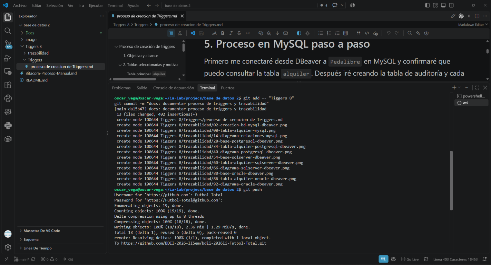

**Conclusión:** registré el informe inicial y las evidencias existentes en el primer commit, y publiqué esos cambios en el repositorio.

### MySQL

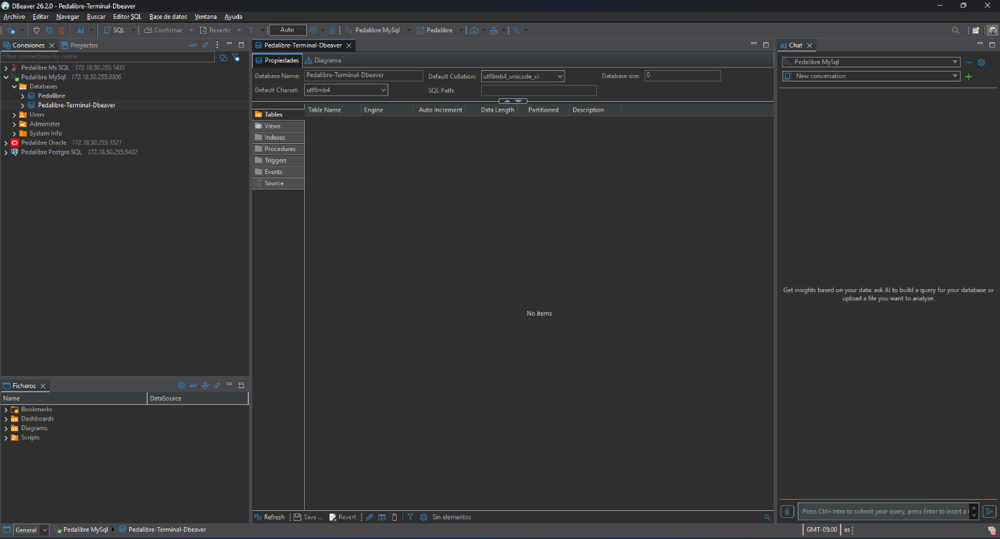

**Conclusión:** confirmé la creación de la base de datos MySQL que utilizaré para implementar y probar los triggers.

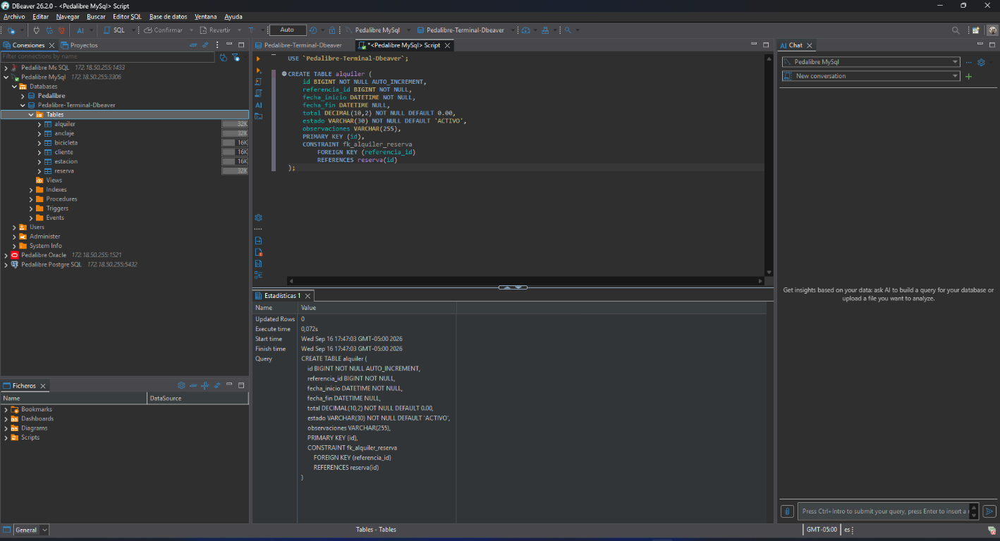

**Conclusión:** revisé la estructura de `alquiler` en MySQL y sus columnas antes de preparar la auditoría.

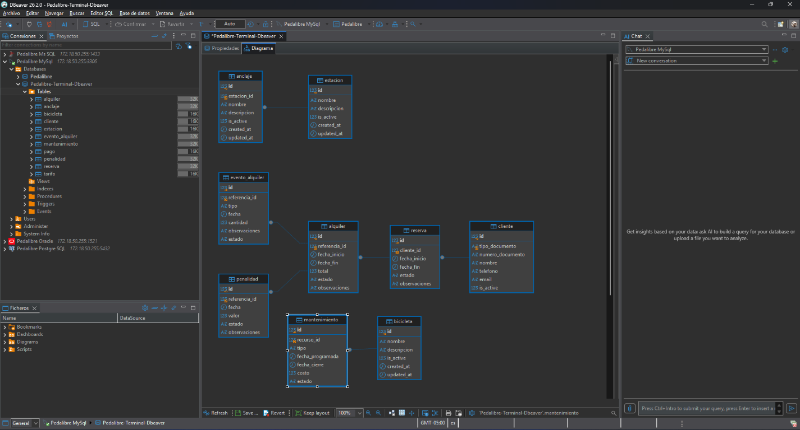

**Conclusión:** identifiqué las relaciones de `alquiler` con las demás tablas del modelo Pedalibre.

### PostgreSQL

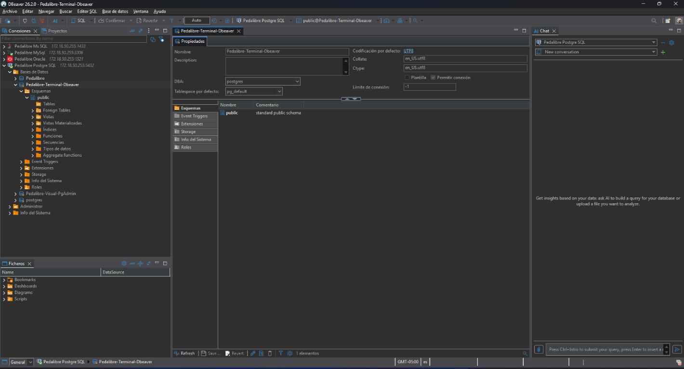

**Conclusión:** confirmé la base Pedalibre en PostgreSQL como parte del modelo existente para la etapa futura de ese motor.

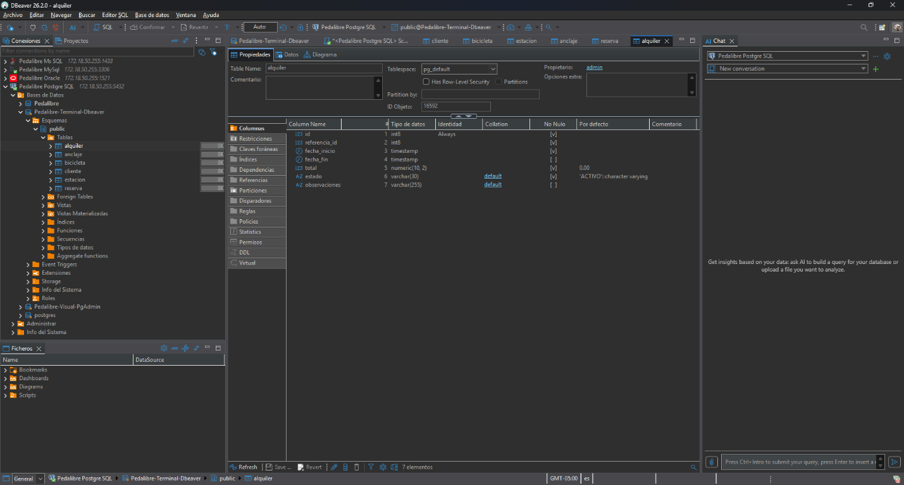

**Conclusión:** revisé la estructura de `alquiler` en PostgreSQL para adaptar el trigger a sus tipos y sintaxis.

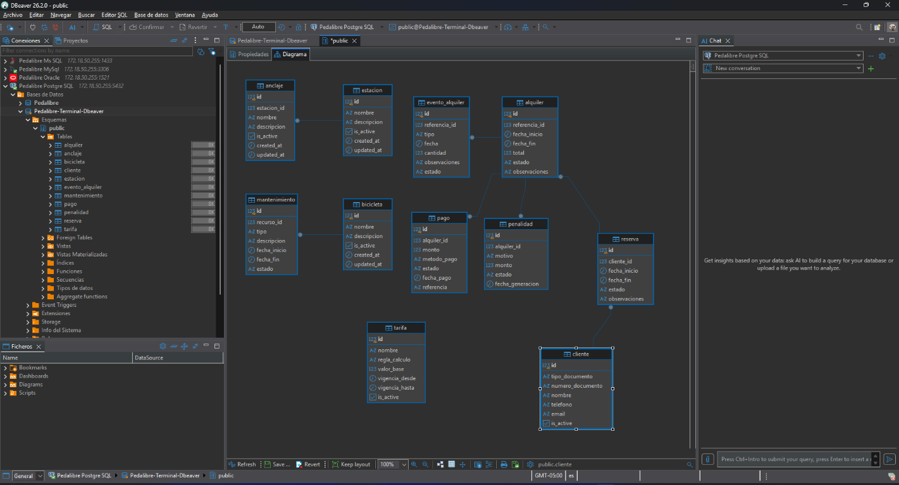

**Conclusión:** verifiqué las relaciones de `alquiler` en el modelo PostgreSQL.

### MSSQL

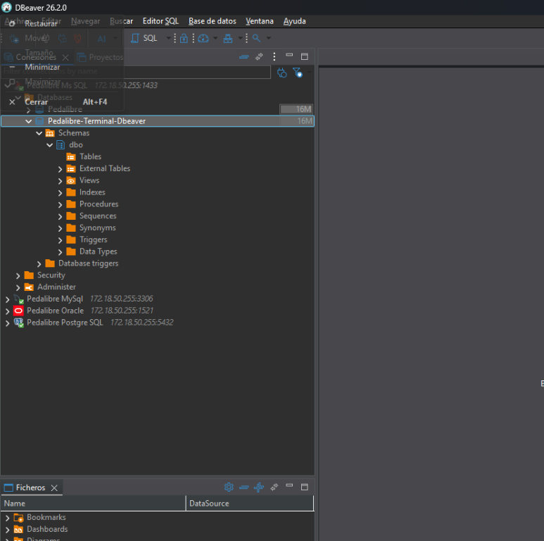

**Conclusión:** confirmé la base Pedalibre en MSSQL como parte del modelo existente para la etapa futura de ese motor.

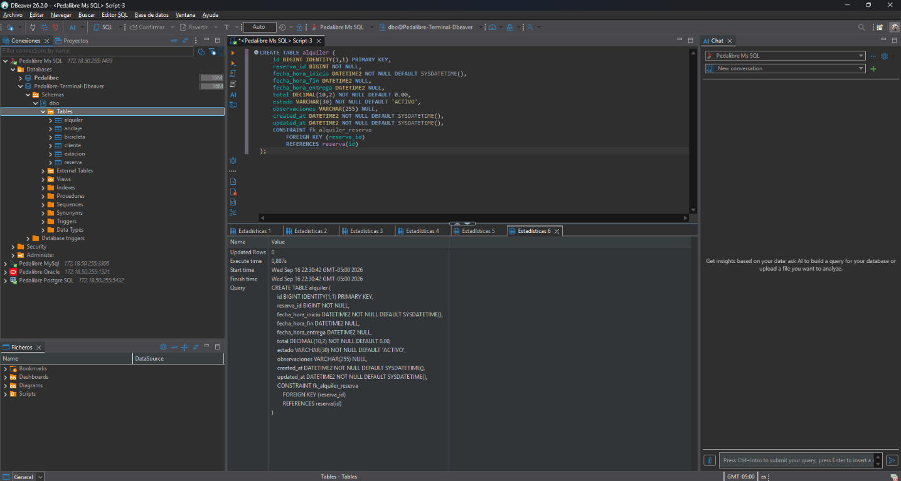

**Conclusión:** revisé la estructura de `alquiler` en MSSQL para considerar que sus triggers trabajan con las tablas `inserted` y `deleted`.

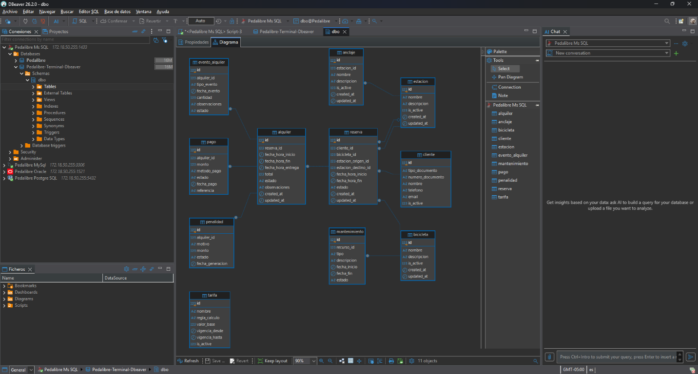

**Conclusión:** verifiqué las relaciones de `alquiler` en el modelo MSSQL.

### Oracle

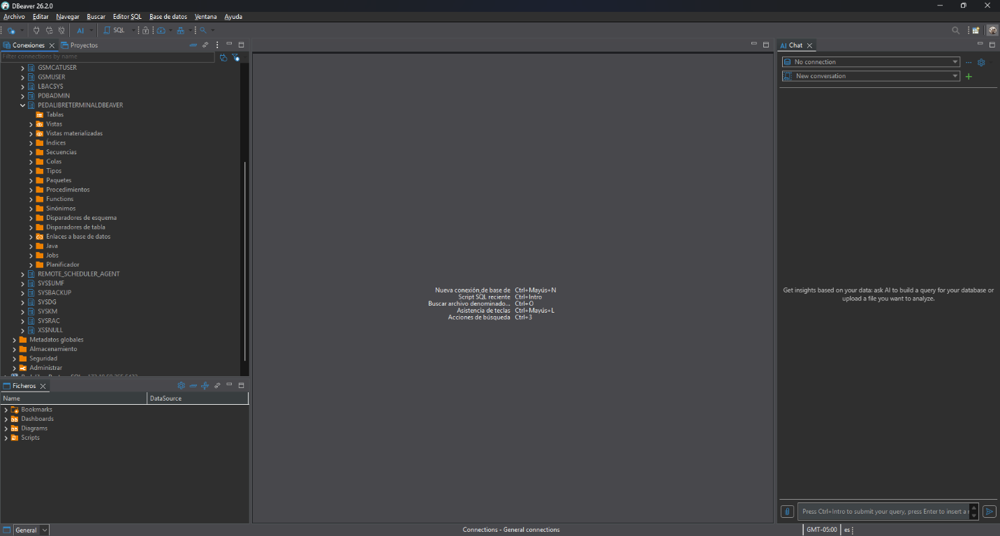

**Conclusión:** confirmé la base Pedalibre en Oracle como parte del modelo existente para la etapa futura de ese motor.

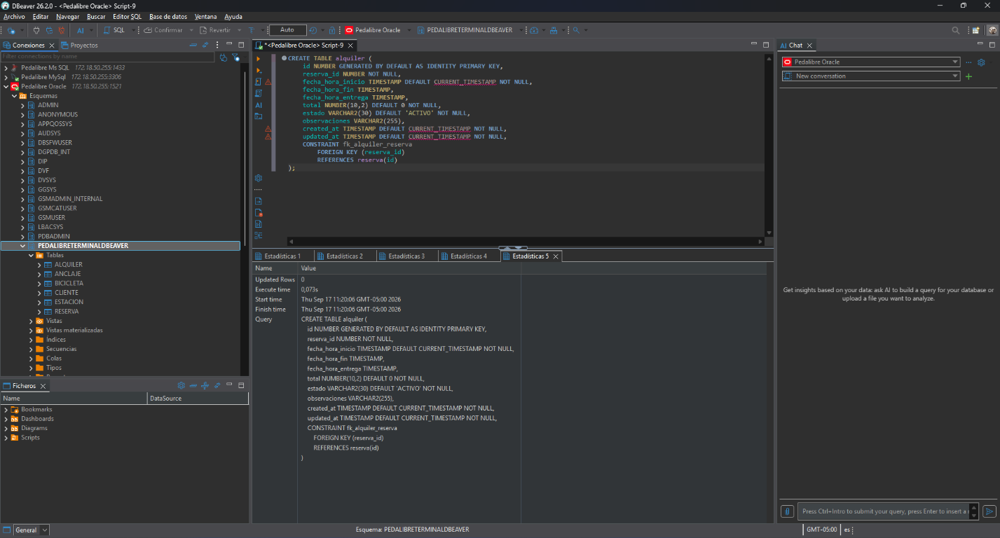

**Conclusión:** revisé la estructura de `alquiler` en Oracle para adaptar los triggers a PL/SQL.

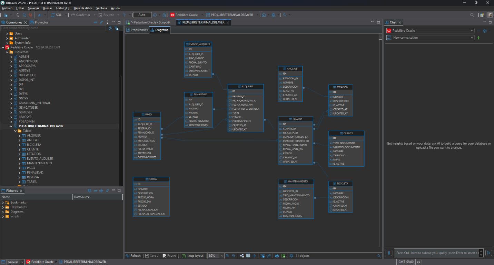

**Conclusión:** verifiqué las relaciones de `alquiler` en el modelo Oracle.

### Avance MySQL 01: tabla de auditoría

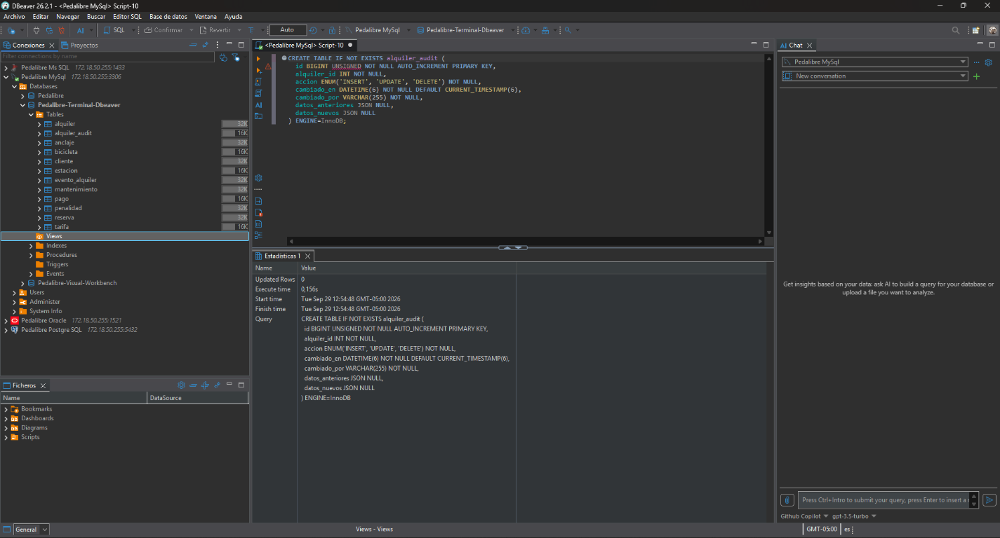

**Conclusión:** ejecuté la creación de `alquiler_audit` en MySQL y confirmé que la tabla aparece en el navegador de DBeaver. En este avance todavía no he creado los triggers.

A medida que avance, incluiré cada captura nueva aquí con una conclusión de lo que hice y guardaré cada etapa en un commit separado antes de continuar.

## Referencias del proyecto

- Modelo y pasos de instalación: [`Docs/instalacion-modelos-base-datos.md`](../../Docs/instalacion-modelos-base-datos.md).
- Bitácora de creación manual y capturas previas: [`Bitacora-Proceso-Manual.md`](../../Bitacora-Proceso-Manual.md).
